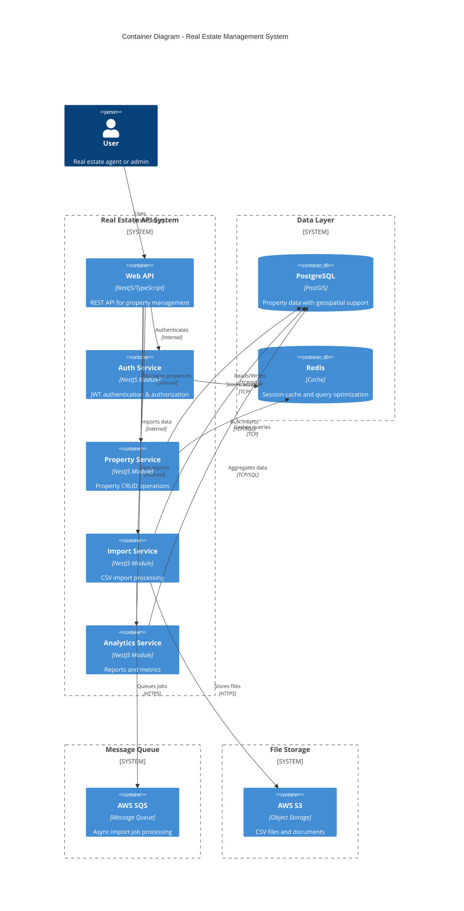

# C4 Model - Level 2: Container Diagram

## Real Estate Management System - Container View

```mermaid
C4Container
    title Container Diagram - Real Estate Management System

    Person(user, "User", "Real estate agent or admin")
    
    System_Boundary(api_boundary, "Real Estate API System") {
        Container(web_app, "Web API", "NestJS/TypeScript", "REST API for property management")
        Container(auth_service, "Auth Service", "NestJS Module", "JWT authentication & authorization")
        Container(property_service, "Property Service", "NestJS Module", "Property CRUD operations")
        Container(import_service, "Import Service", "NestJS Module", "CSV import processing")
        Container(analytics_service, "Analytics Service", "NestJS Module", "Reports and metrics")
    }
    
    System_Boundary(data_boundary, "Data Layer") {
        ContainerDb(postgres, "PostgreSQL", "PostGIS", "Property data with geospatial support")
        ContainerDb(redis, "Redis", "Cache", "Session cache and query optimization")
    }
    
    System_Boundary(queue_boundary, "Message Queue") {
        Container(sqs, "AWS SQS", "Message Queue", "Async import job processing")
    }
    
    System_Boundary(storage_boundary, "File Storage") {
        Container(s3, "AWS S3", "Object Storage", "CSV files and documents")
    }

    Rel(user, web_app, "Uses", "HTTPS/REST")
    Rel(web_app, auth_service, "Authenticates", "Internal")
    Rel(web_app, property_service, "Manages properties", "Internal")
    Rel(web_app, import_service, "Imports data", "Internal")
    Rel(web_app, analytics_service, "Gets reports", "Internal")
    
    Rel(auth_service, redis, "Stores sessions", "TCP")
    Rel(property_service, postgres, "Reads/Writes", "TCP/SQL")
    Rel(property_service, redis, "Caches queries", "TCP")
    Rel(import_service, sqs, "Queues jobs", "HTTPS")
    Rel(import_service, s3, "Stores files", "HTTPS")
    Rel(import_service, postgres, "Bulk inserts", "TCP/SQL")
    Rel(analytics_service, postgres, "Aggregates data", "TCP/SQL")
```