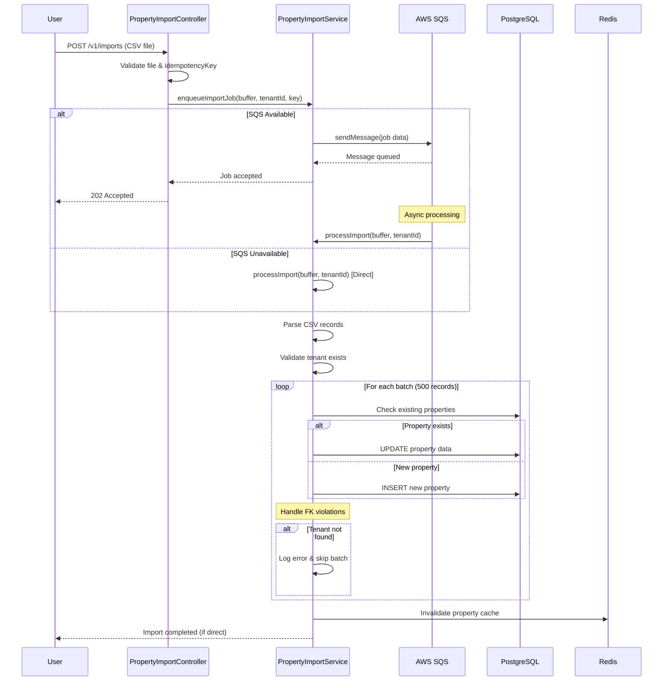

# Sequence Diagram - CSV Import Process

## Property Import Flow

```mermaid
sequenceDiagram
    participant User
    participant Controller as PropertyImportController
    participant Service as PropertyImportService
    participant SQS as AWS SQS
    participant DB as PostgreSQL
    participant Cache as Redis

    User->>Controller: POST /v1/imports (CSV file)
    Controller->>Controller: Validate file & idempotencyKey
    Controller->>Service: enqueueImportJob(buffer, tenantId, key)
    
    alt SQS Available
        Service->>SQS: sendMessage(job data)
        SQS-->>Service: Message queued
        Service-->>Controller: Job accepted
        Controller-->>User: 202 Accepted
        
        Note over SQS: Async processing
        SQS->>Service: processImport(buffer, tenantId)
    else SQS Unavailable
        Service->>Service: processImport(buffer, tenantId) [Direct]
    end
    
    Service->>Service: Parse CSV records
    Service->>Service: Validate tenant exists
    
    loop For each batch (500 records)
        Service->>DB: Check existing properties
        alt Property exists
            Service->>DB: UPDATE property data
        else New property
            Service->>DB: INSERT new property
        end
        
        Note over Service: Handle FK violations
        alt Tenant not found
            Service->>Service: Log error & skip batch
        end
    end
    
    Service->>Cache: Invalidate property cache
    Service-->>User: Import completed (if direct)
```